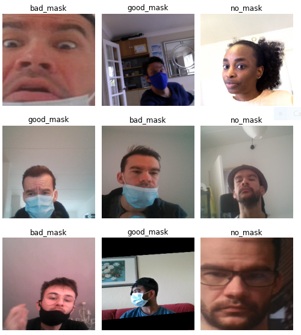

# Face Mask Detector 
#### Strive School Build Week 3 project
Face Mask Detection system built with OpenCV and PyTorch using Computer Vision and Deep Learning concepts in order to detect face mask usage.

# Team
* [Bence Kovacs](https://github.com/kovacsbelsen)
* [Lorenzo Demiri](https://github.com/lorenzodemiri)
* [Michal Podlaszuk](https://github.com/MichalPodlaszuk)
* [Agnese Marchisella Navarro](https://github.com/comicodex)

# Introduction
Considering the state of the world today with thousands of people dying everyday due to the Covid-19 pandemic, wearing a face mask is crucial in minimizing the spread of the virus. Our project consists in the creation of a custom deep learning model to detect whether a person is wearing or not wearing a face mask and if they are wearing it correctly that works both on static images and in real-time video streams. This project can be easily integrated in real-life applications in shops, schools, airports, offices and public places to ensure that public safety guidelines are followed.

# Framework used
* [OpenCV](https://opencv.org)
* [Haar Cascades Face Detector](https://github.com/opencv/opencv/tree/master/data/haarcascades)
* [PyTorch](https://pytorch.org)
* [Fast.AI](https://docs.fast.ai)
* [ResNet34](https://https://pytorch.org/hub/pytorch_vision_resnet/)

# Dataset
We created our own custom dataset with 6829 images belonging to three different classes:  ['bad_mask', 'good_mask', 'no_mask'] 
This is done by capturing images with our desktop cameras and the OpenCV library and labelling facial landmarks by drawing a rectangular bounding box around the face and keypoints on the eyes. The last step consists in merging all the images (our own and our peers') in their respective folders for the creation of the final dataset.

## Face Detection
We use the Haar Cascades Face Detector to extract faces from the images.

## Mask, no mask or bad mask classification
A Face Mask Classifier model (ResNet34) is trained for identifying people not wearing a face mask. For aiding the training process, augmented masked faces are generated using facial landmarks. We test it on two validation sets:

* [Real-World-Masked-Face-Dataset](https://github.com/X-zhangyang/Real-World-Masked-Face-Dataset)
* our own custom dataset

This allows us to keep track of the model's performance. 

## Model performance
Our model gave us 95% accuracy after training.

## Project Demo
[Face Mask Detector](https://drive.google.com/file/d/1h1-cLRCltDYIkGdMwj1TToPM6Fnqy6jP/view)

## Final note
Thank you for visiting our Repository!

